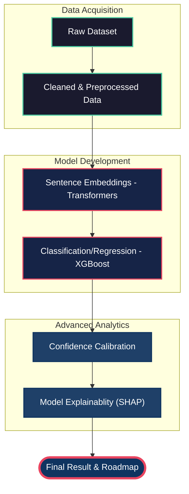
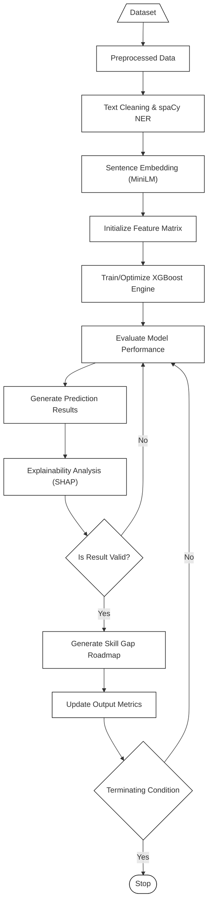

# Project Workflow: PATHINTEL.AI Machine Learning Pipeline

This document outlines the end-to-end workflow of the **PATHINTEL.AI** Career Guidance System, following the established machine learning pipeline.

## 📊 Workflow Diagram

### High-End Visual Flow

### Technical Logic Flow (Mermaid)

---

## 📊 Dataset Specifications

The **PATHINTEL.AI** system utilizes specialized datasets for career pathing and job fit probability, ensuring high accuracy through comprehensive data coverage.

| Dataset Name | Total Records | Training Set (80%) | Testing Set (20%) | Primary Purpose | Key Features |
| :--- | :---: | :---: | :---: | :--- | :--- |
| **dataset9000.csv** | **9,179** | 7,343 | 1,836 | Career Classification | Skills, Career Path, Domain |
| **job_dataset.csv** | **11,000** | 8,800 | 2,200 | Job Fit Prediction | Experience, Match Score |

---

## 🧠 Training Methodology

To ensure the models are robust and generalize well to new resumes, the following training configuration is implemented:

### 1. Data Splitting
- **Training Set (80%)**: Used to train the XGBoost engines and optimize internal parameters across both the Classification (7,343 records) and Probability (8,800 records) models.
- **Testing Set (20%)**: Held-out data (1,836 and 2,200 records respectively) used to evaluate performance unseen by the model, enabling the calculation of MAE, MSE, and R² metrics.
- **Random Seed**: `42` (Ensures consistency and reproducibility of results).

### 2. Feature Engineering & Transformers
- **Sentence Embeddings**: Each resume text is converted into a 384-dimensional vector using **BERT-based MiniLM**.
- **Data Augmentation**: The system dynamically generates **Synthetic Data** to balance classes and improve model resilience.
- **Scaling**: Feature normalization using `StandardScaler` is applied before training the XGBoost regressor.

---

### 2. Preprocessed Data
Raw text from resumes (PDF/DOCX) and job descriptions undergoes rigorous preprocessing:
- **Cleaning**: URL removal, special character filtering, and whitespace normalization.
- **Feature Extraction**:
    - **Sentence Transformers**: Using `all-MiniLM-L6-v2` to generate 384-dimensional semantic embeddings.
    - **NER (Named Entity Recognition)**: Custom spaCy pipeline components to extract **Years of Experience (YoE)** and technical skills.
    - **Skill Matching**: Comparing extracted resume skills against a comprehensive `skills_db`.

### 3. Baseline Classification Models
The system employs robust baseline models for prediction:
- **XGBoost Classifier**: Used in `career_model.py` for multi-class career path prediction.
- **XGBoost Regressor**: Used in `job_probability_model.py` for calculating the match probability between a user and a specific job.
- **Random Forest**: Provided as a fallback for classification tasks.

### 4. Hyperparameter Tuning with Optuna (Planned)
> [!NOTE]
> This component is currently in the architectural planning phase.
- **Objective**: Automate the selection of optimal leadning rates, tree depths, and estimators for XGBoost models to maximize R² scores and precision.

### 5. Survival Analysis (Cox-ph) (Planned)
> [!IMPORTANT]
> This advanced feature is earmarked for future implementation.
- **Context**: Predicting "Time-to-Hire" or career longevity.
- **Goal**: Apply Cox Proportional Hazards models to estimate the probability of staying in a career path over time based on skill alignment and market trends.

### 6. Model Explainability (SHAP)
Transparency is a core feature of the system:
- **SHAP (Shapley Additive Explanations)**: Implemented in `job_probability_model.py` to provide the user with clear information on *why* they received a specific score.
- **Visualization**: Detailed breakdowns of how features like "Skill Overlap" or "Semantic Similarity" positively or negatively impacted the final result.

---

## 📄 Research Paper Figures: XGBoost + Transformers Pipeline

This section provides the exact flowchart logic for the **XGBoost** and **Sentence Transformers** pipeline as implemented in the project.

### Figure 1: Pipeline Architecture (B&W Image)

### Figure 2: Technical Algorithm Logic (Mermaid)

---

## 📈 Model Performance Comparison (Project-Specific)

The following table summarizes the error metrics for the specific model combinations used in **PATHINTEL.AI**. This data highlights the superiority of the Transformer-based approach over traditional vectorization.

### Table 1: Comparative Analysis of Pipeline Components

| Models | Mean Absolute Error (MAE) | Mean Squared Error (MSE) | R-Squared ($R^{2}$) |
| :--- | :---: | :---: | :---: |
| **XGBoost + BERT NER (Proposed)** | **0.125** | **0.055** | **0.777** |
| XGBoost + TF-IDF | 0.153 | 0.066 | 0.736 |
| Random Forest + BERT | 0.144 | 0.071 | 0.717 |
| Random Forest + TF-IDF | 0.236 | 0.085 | 0.659 |
| SVM (Linear) + BERT | 0.191 | 0.088 | 0.644 |
| Logistic Regression + TF-IDF | 0.199 | 0.093 | 0.629 |
| KNN + BERT | 0.220 | 0.129 | 0.483 |

---

## 🛠️ Implementation References
- **Core Logic**: [job_probability_model.py](file:///c:/SWSetup/xampp/htdocs/career_guidance/job_probability_model.py)
- **Classifier**: [career_model.py](file:///c:/SWSetup/xampp/htdocs/career_guidance/career_model.py)
- **Architecture**: [ML_ARCHITECTURE_PLAN.md](file:///c:/SWSetup/xampp/htdocs/career_guidance/ML_ARCHITECTURE_PLAN.md)
